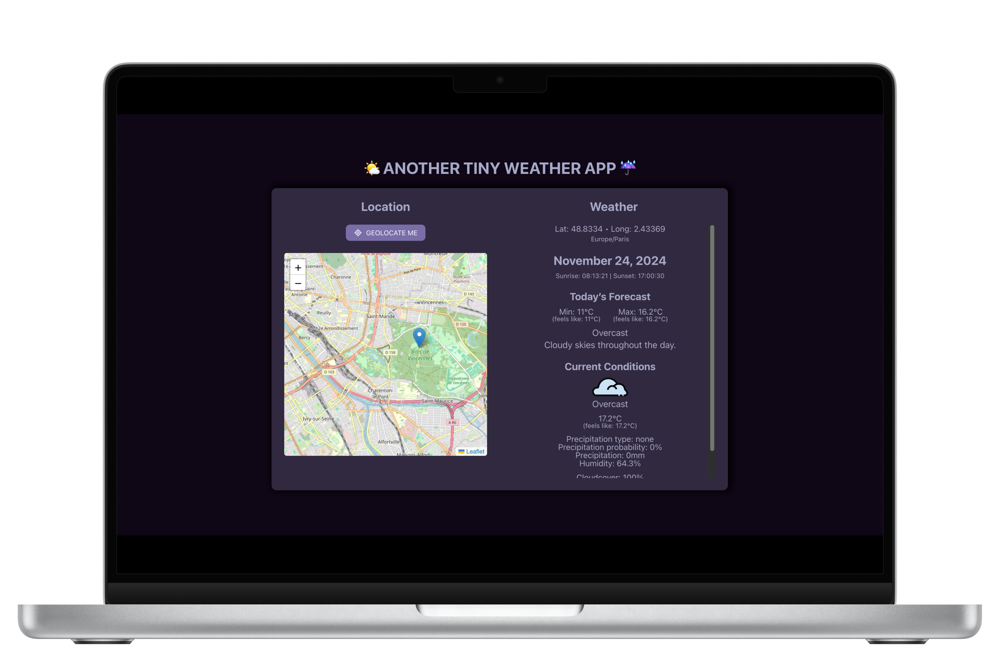

# Tiny Weather App 🌦

## 📝 Project Overview

This project aims at displaying weather data based on specific coordinates. I'am using the [Visual Crossing Weather API](https://www.visualcrossing.com/) (it's free and easy to customize!). I wanted to discover something new, so I decided to go with an interactive map to select coordinates and try "JS-in-CSS" styling technique.

The map was pretty easy to generate, but the challenge was to make it responsive to every coordinates update to ensure a smooth user experience. As such, the view "flies" to the marker on the map whenever coordinates change (either  from geolocation or manual selection). I also took my first steps into "JS-in-CSS" styling with Vanilla-Extract! Fun time! I kept the design of this app very simple, but I enjoyed using Typescript to create styles and layout. I am really excited to discover more features of this library on future projects.

A [deployed version](https://weather-app.nolliechtn6.com/) of the project is available! 🚀

## ✨ Features

- **Weather Data**: get weather data from the [Visual Crossing Weather API](https://www.visualcrossing.com/).
- **Geolocation**: use the `geolocate` feature to get weather data for your location.
- **Manual coordinates selection**: simply click on the map to display weather data for this location.
- **Day Forecast & Current Conditions Display**: visualize forecast summary for the day and current conditions (the latter are based on coordinates selection date & time).

## 🔧 Technologies Used

- 🌥️ [Visual Crossing Weather API](https://www.visualcrossing.com/)
- ⚛️ React and Typescript
- 🐻 [Zustand](https://zustand-demo.pmnd.rs/) to store my app state globally and easily access data
- 🌱 [React Leaflet](https://react-leaflet.js.org/) to generate an interactive map for the user to select coordinates
- 🧭 [Luxon](https://moment.github.io/luxon/#/) for date formatting
- 🧁 [Vanilla-Extract](https://moment.github.io/luxon/#/) for "JS-in-CSS" styling

## 🚀 How to Run the Project

⚠️ Please note that you will need a personal API key to run the project locally. To get your key, create an account on the the [Visual Crossing Weather API Website](https://www.visualcrossing.com/resources/documentation/weather-data/getting-started-with-weather-data-services/). You will then be able to retrieve the key from the "Account" section.

To get the Weather Application running locally, follow these steps:

1. Clone the repository.
2. Run `npm install` in your terminal to install the necessary dependencies.
3. Create an `.env` file.
4. Create a `VITE_VISUAL_CROSSING_API_KEY` variable with your personal API key.
5. Start the development server using `npm run dev`.

## ✅ Future Improvements

- [ ] Improve UI and app design
- [ ] Select a city from a dropdown menu
